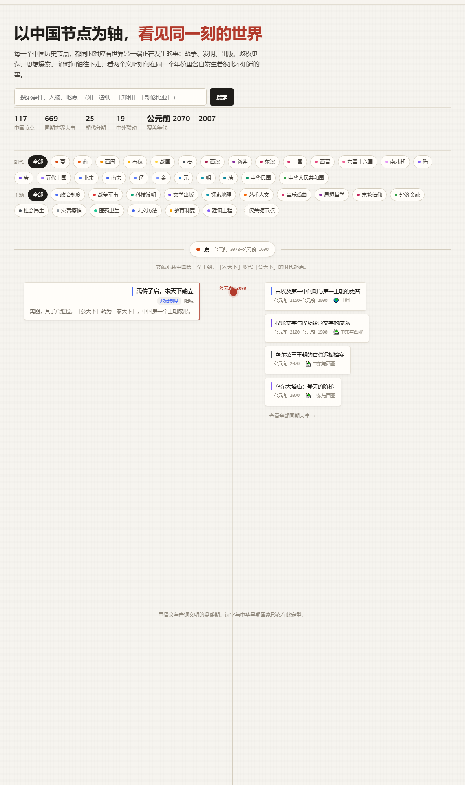
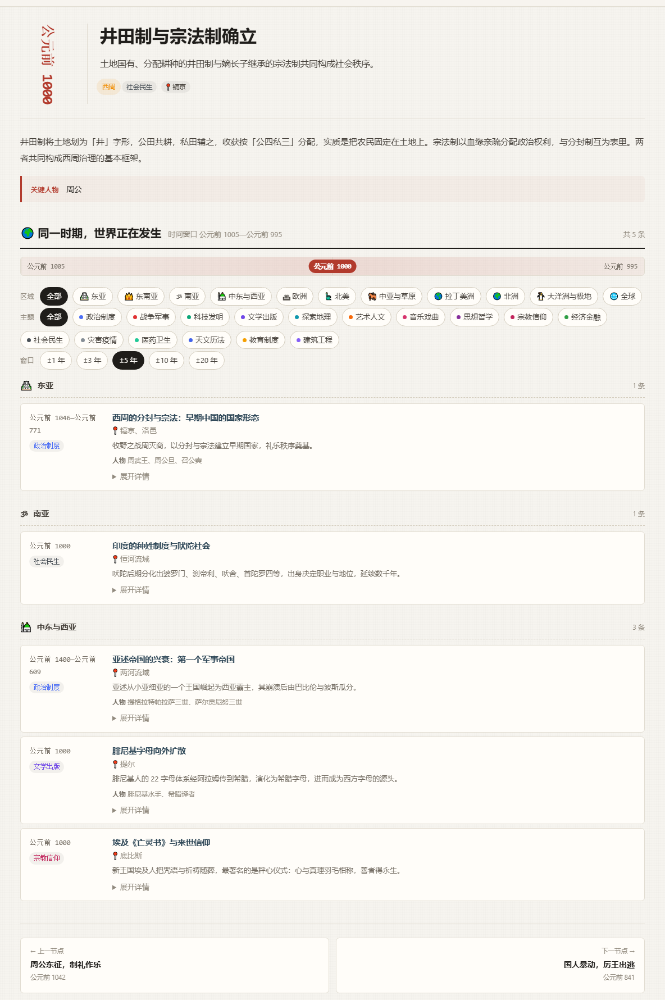
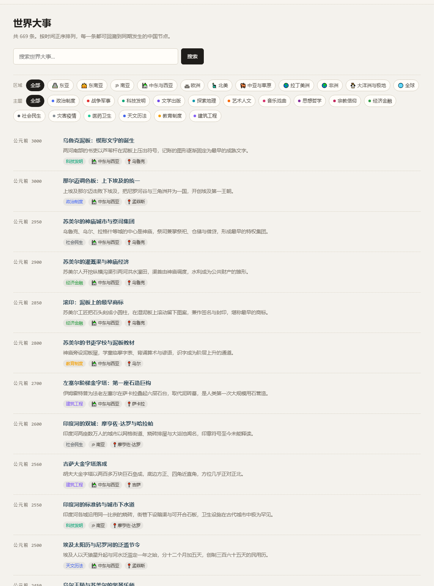
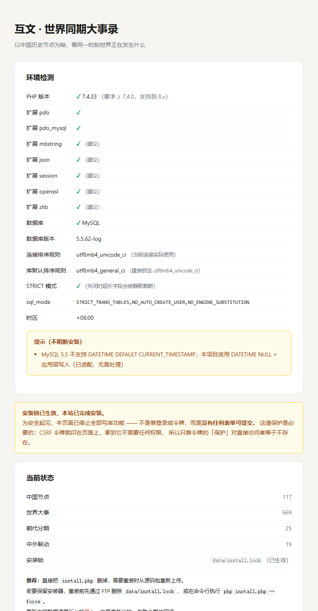

<div align="center">

# 互文 · 世界同期大事录

**以中国历史节点为轴，看同一时刻世界正在发生什么。**

[](https://www.php.net/)
[](https://dev.mysql.com/)
[](LICENSE)

一个零依赖、零构建的 PHP + MySQL 历史对照阅读工具。
左侧是中国历史节点，右侧是这个节点时间窗口内全世界发生的战争、发明、出版、政权更迭与思想爆发。

</div>

---

## 目录

- [效果图](#效果图)
- [这是什么](#这是什么)
- [快速开始](#快速开始)
- [功能](#功能)
- [数据模型](#数据模型)
- [内容维护](#内容维护)
- [项目结构](#项目结构)
- [环境要求](#环境要求)
- [安全](#安全)
- [开发](#开发)
- [常见问题](#常见问题)
- [许可与免责](#许可与免责)

---

## 效果图

### 首页 · 时间轴（桌面）

左侧中国节点、右侧同期世界大事，可按 25 个朝代与 16 类主题筛选。



### 节点详情 · 同一时期，世界正在发生

核心页面。**时间窗口可调（±1 到 ±20 年）**，可按 11 个区域与主题筛选，
并用紫色卡片标出真正存在因果关系的中外联动。



### 首页 · 移动端

窄屏下时间轴重排为单列、筛选面板折叠为一行 sticky 按钮。


### 世界大事列表



### 安装向导

上传后首次访问域名自动进入。填数据库信息 → 环境检测 → 安装，一次完成。



---

## 这是什么

学中国历史时，很容易把中国当成一条孤立的线：某年发生某事。但同一时刻，罗马正在扩张、
阿拉伯帝国正在贸易、美洲在独立、欧洲在启蒙。**彼此并不知道对方存在，却在同一条时间线上互相挤压。**

互文把这条对照线画出来。它是**历史学习辅助工具，不是学术著作**。

### 站名释义

**互文**，取文学批评术语 *intertextuality*：两部作品彼此引用、彼此生成意义。

用在这里指同一年里中国与世界互相构成对方的历史 —— 没有欧亚商贸与思想流动，
就没有中国的造纸术外传；没有中国的丝与瓷，也没有欧洲远洋航行的动力。
**两边不是主从关系，而是互相参照、彼此改写。**

### 内容口径

- 事件年代与人物生卒采用**通说**；早期断代（尤其夏商周）存在学术分歧，取主流说法，欢迎指正
- **中外并列仅表示大致同时期，不代表存在因果关系。** 真正有因果或结构性呼应的节点已单独用「联动」标出（如「怛罗斯之战 → 造纸术西传」「工业革命 → 鸦片战争」）
- 涉及近现代史的表述，以中国现行中学历史教材的通行口径为基础
- 种子内容由 AI 生成后人工整理，细节与年代可能存在错误，**请以权威史料为准**

### 内置内容

| 项 | 数量 |
|---|---|
| 朝代分期 | 25（夏商周 → 当代） |
| 中国历史节点 | 117 |
| 同期世界大事 | 669 |
| 中外联动关系 | 19 |
| **±5 年窗口覆盖率** | **100%**（每个节点点开都有对照内容） |

时间跨度：夏（约公元前 2070 年）→ 公元 2026 年。

---

## 快速开始

### 三步安装

1. **上传全部文件**到网站根目录（或子目录）。该目录需有**写权限**。

2. **浏览器访问你的域名**，会自动跳到安装向导：

   ```
   http://你的域名/    →  302  →  /install.php
   https://你的域名/   →  302  →  /install.php
   ```

   > **`http://` 与 `https://` 都可安装、可用，无差别。**

   向导共三步：

   | 步骤 | 内容 |
   |---|---|
   | ① 数据库 | 填地址、端口、库名、用户名、密码 → 自动测连接 |
   | ② 环境检测 | 自动显示 PHP 版本、扩展、数据库版本、排序规则、`sql_mode` |
   | ③ 安装 | 建表 → 导入数据 → 写配置 → 上锁 |

   **不需要手工编辑任何文件。** 数据库配置由安装器自动写入 `config.local.php`。

   **库不存在也没关系** —— 安装器会尝试自己建（`CREATE DATABASE`，字符集自动 `utf8mb4`），
   并先建一张临时表验证权限再删掉。

   > ⚠️ **自动建库需要 MySQL 账号有全局 `CREATE` 权限。** 宝塔与多数虚拟主机
   > 默认只给「单库」权限，此时自动建库会失败并明确告诉你 ——
   > 那时在面板「数据库」点「添加数据库」（字符集 `utf8mb4`），把库名回填到表单即可。
   >
   > 唯一前置条件：**站点根目录要可写**（安装器要在那里写配置）。

3. **安装完成**，页面给你两个大按钮：**进入前台** / **进入后台**，
   并显示管理员账号 `admin` 的**随机密码（只显示这一次，刷新即失效、无法找回）**。

   登录后台后请立刻在「账户」里改成自己的密码。

装之前可以先跑一次装前自检（包里有 `selftest.php`）：

```bash
php selftest.php
```

### 手工配置（可选）

若环境不允许安装器写文件（如目录只读），可自己建 `config.local.php`：

```php
<?php
return [
    'db' => [
        'driver'     => 'mysql',
        'host'       => '127.0.0.1',
        'port'       => 3306,
        'name'       => 'your_database',
        'user'       => 'your_user',
        'pass'       => 'your_password',
        'charset'    => 'utf8mb4',
        'persistent' => true,
    ],
];
```

放好后直接访问 `/install.php` 会跳过第一步，从环境检测开始。

### 安装锁

安装完成时写入 `data/install.lock`，此后 `install.php` **只读**：
不渲染任何表单，伪造 POST 也返回 403。

> CSRF 防的是跨站触发，不防直接访问 —— 而令牌就印在页面上。
> 所以这道保护不能靠令牌，必须靠「根本没有可提交的东西」。

重装需服务器权限：FTP 删 `data/install.lock`，或命令行 `php install.php --force`。

---

## 功能

**前台**

- **时间轴首页** —— 左侧中国节点、右侧同期世界大事，按朝代（25 个）+ 主题（16 类）筛选
- **节点详情** —— 时间窗口可调 ±1 ~ ±20 年；按区域（11 个）与主题筛选；联动关系高亮标出
- **世界大事列表** —— 完整列表，每条可反查同期中国节点
- **全站搜索** —— 事件、人物、地点
- **用户投稿** —— 注册后可提交，**须管理员审核**才出现在前台
- **响应式** —— 手机 / 平板 / 桌面 / 超宽屏；移动端筛选面板折叠、时间轴重排

**后台**

- 中国节点、世界大事、中外联动、朝代分期的增删改查
- CSV 批量导入（含模板下载、去重、覆盖选项）
- 内容数据包导出 / 导入（ZIP）
- 投稿审核
- 概览统计与内容覆盖情况

---

## 数据模型

```
dynasties（中国历史分期）
    │
    ├── cn_events（中国历史节点）──── relations（中外联动）──── world_events（世界大事）
    │        ↑                                                      ↑
    │   时间主轴上的锚点                按 year 独立存储
    │   （页面入口）                                          （节点页按 ±N 年窗口检索）
    │
    └── categories / regions / relation_types（字典表）
```

### 关键设计一：带符号年份

所有年份用**带符号整数**存储，公元前 2070 年记为 `-2070`，公元 2026 年记为 `2026`。

好处是 SQL 里可以直接做数值区间比较，不需要在查询时区分公元 / 公元前两套逻辑：

```sql
-- 命中窗口内的世界大事（单点事件 + 区间事件都要覆盖）
WHERE (
    (year_end IS NULL AND year BETWEEN :lo AND :hi)
 OR (year_end IS NOT NULL AND year <= :hi AND year_end >= :lo)
)
```

展示层由 `fmt_year()` / `fmt_year_range()` 转成「公元前 2070 年」这样的文本。

### 关键设计二：内容即数据包

内容不以 PHP 数组存放，而是 `data/seed/*.json`（约 850 KB）。
格式定义 / 导出 / 校验 / 导入**共用同一份表定义**，改字段只改一处。

```
data/seed/
├── manifest.json      清单与行数
├── dynasties.json     朝代分期
├── cn_events.json     中国历史节点
├── world_events.json  世界大事
├── relations.json     中外联动（按标题互引，落库时转外键）
└── README.md          数据格式说明
```

安装与恢复走同一条路，不存在「种子数据」和「导入数据」两套格式。

---

## 内容维护

### 方式一：后台界面

登录后逐条增删改，支持按朝代、主题、年份区间、关键词筛选与分页。适合零散补充。

### 方式二：CSV 批量导入

后台「导入」页可下载两种模板。适合大量补充。

**中国节点模板**

| 字段 | 必填 | 说明 |
|---|---|---|
| `title` | ✓ | 事件标题，同时作为去重依据 |
| `dynasty_slug` | ✓ | 朝代标识，如 `qin` / `tang` / `bei_song` |
| `year` | ✓ | 年份，公元前用负数，如 `-221` |
| `year_end` | | 区间事件的结束年，单点留空 |
| `month` / `day` | | 精确日期 |
| `category` | | `politics` `war` `science` `literature` `explore` `culture` `religion` `economy` `society` `disaster` |
| `place` | | 地点 |
| `summary` | | 一句话概述（显示在时间轴卡片） |
| `detail` | | 详细描述（节点详情页） |
| `figures` | | 关键人物，顿号分隔 |
| `importance` | | 1–5，默认 3 |
| `is_key` | | 1 = 关键节点（时间轴标红） |

**世界大事模板**

| 字段 | 必填 | 说明 |
|---|---|---|
| `title` | ✓ | 事件标题 |
| `year` / `year_end` | ✓ / | 年份，公元前用负数 / 结束年 |
| `region` | | `east_asia` `south_asia` `west_asia` `europe` `north_america` `latam` `africa` `oceania` `global` |
| `category` | | 同上 |
| `place` / `summary` / `detail` / `figures` / `importance` | | 同中国节点 |
| `source` | | 来源参考，便于日后核查 |

> 导入时 `title` 完全相同视为重复，默认跳过；勾选「覆盖」则更新已有记录。
> 导入后逐行报告成功 / 跳过 / 失败及原因。
> CSV 需 UTF-8 编码（Excel 另存为选「CSV UTF-8（逗号分隔）」）。

### 方式三：改 JSON 数据包

直接编辑 `data/seed/*.json`，格式见 [`data/seed/README.md`](data/seed/README.md)。

`relations` 用**标题**而非 ID 互相引用，安装时自动转成外键。

> ⚠️ 改标题等于换身份 —— 联动关系是按标题查找的。

---

## 项目结构

```
.
├── index.php              前台首页：主时间轴
├── node.php               节点详情：同期世界大事（核心页面）
├── world.php              世界大事列表 / 详情
├── search.php             全站搜索
├── about.php              关于与免责声明
├── register.php           用户注册
├── contribute.php         投稿
├── contributors.php       贡献者名单
├── install.php            安装向导（装完自动上锁变只读）
├── selftest.php           装前自检（可独立运行）
├── config.php             全局配置
│
├── inc/                   公共代码
│   ├── bootstrap.php      依赖收敛 + URL 助手 + 会话
│   ├── config.php         配置读取器 cfg()
│   ├── db.php             PDO 访问层
│   ├── schema.php         建表 DDL + 分类/区域字典
│   ├── helpers.php        年份格式化、CSRF、鉴权、业务查询
│   ├── install_gate.php   安装闸门（必须在 bootstrap 之前）
│   ├── install_precheck.php 安装第一步：不连库，只收数据库信息
│   ├── env_check.php      环境自检
│   ├── datapack.php       内容数据包：导出 / 校验 / 导入
│   └── layout_*.php       页头页脚
│
├── admin/                 管理后台
│   ├── login.php  logout.php  index.php  account.php
│   ├── cn_events.php  world_events.php  relations.php  dynasties.php
│   ├── import.php  export.php  restore.php
│   └── submissions.php    投稿审核
│
├── user/                  用户中心
├── data/
│   ├── seed/*.json        内容数据包
│   └── install.lock       安装锁（装完生成）
├── assets/                样式与前端脚本
├── docs/                  文档与配图
├── tools/                 开发期自检脚本
└── .htaccess              Apache 目录保护
```

---

## 环境要求

| 项 | 要求 |
|---|---|
| PHP | **7.4 ~ 8.4**（不使用任何 8.x 移除的特性） |
| 扩展 | `pdo` + `pdo_mysql`（必需），`mbstring` / `json` / `session`（建议） |
| 数据库 | **MySQL 5.5 ~ 8.4** / MariaDB 10.x |
| Web 服务器 | Apache / Nginx / PHP 内置服务器均可 |
| 磁盘 | 约 5 MB（其中数据包约 850 KB） |

**没有 Composer、没有 npm、没有构建步骤、没有 CDN、没有外部依赖。** 上传即用。

### 三个版本兼容要点

这些不是风格问题，是真的会踩的坑：

**1. 不使用 `DATETIME DEFAULT CURRENT_TIMESTAMP`**

该语法 MySQL 5.6+ 才有，5.5 不支持。所有时间列都是 `DATETIME NULL`，
由应用层用 `SQL_NOW` 常量显式写入。**这既是 5.5 兼容方案，也是 8.x 上的稳定做法。**

时间戳拼接的正确写法（**`php -l` 查不出写错的版本**）：

```php
// 正确：引号闭合后再拼接
'INSERT INTO t (a, created_at) VALUES (?, ' . SQL_NOW . ')'

// 错误：拼接符落在单引号串内，SQL_NOW 变字面量 → 1292 Invalid datetime
'INSERT INTO t (a, created_at) VALUES (?, " . SQL_NOW . ")'
```

**2. 建表显式锁定 `utf8mb4_unicode_ci`**

MySQL 8.0 的 utf8mb4 默认排序规则是 `utf8mb4_0900_ai_ci`，5.5 是 `utf8mb4_general_ci`，
两者对中文的排序结果不同。同一份数据装在不同版本上，`ORDER BY` 顺序会变。
`utf8mb4_unicode_ci` 是 5.5 到 8.4 唯一的**安全交集**。

**3. `sql_mode` 追加而非覆盖**

```php
// ✗ 覆盖式：会把服务端原有的 NO_ZERO_DATE / ONLY_FULL_GROUP_BY 全丢掉
SET SESSION sql_mode = 'STRICT_ALL_TABLES,NO_ENGINE_SUBSTITUTION'

// ✓ 追加式（见 inc/db.php 的 initSession）
SET SESSION sql_mode = CONCAT_WS(',', NULLIF(@@SESSION.sql_mode, ''),
                                'STRICT_TRANS_TABLES', 'NO_ENGINE_SUBSTITUTION')
```

覆盖式写法在 5.5 上看不出问题，但在 8.0 上等于**主动关闭了它精心设计的默认防护**。

---

## 安全

| 项 | 实现 |
|---|---|
| SQL 注入 | 全部查询走 PDO 预处理；`LIMIT` / `OFFSET` 强制 `(int)` 转换；动态表名过白名单 |
| XSS | 所有输出经 `h()`（`htmlspecialchars` + `ENT_QUOTES`） |
| CSRF | 所有 POST 表单带 `_csrf` 令牌，含安装器 |
| 会话固定 | 登录后 `session_regenerate_id(true)` |
| 密码存储 | `password_hash()` / `password_verify()`，登录失败用假 hash 防用户名枚举 |
| 暴力破解 | 登录 5 次 / 5 分钟、注册 10 次 / 1 小时限流 |
| 重名竞态 | `users.username` 加唯一索引，数据库层兜底 |
| Cookie | `httponly` + `samesite=Lax` + HTTPS 下 `secure` |
| 响应头 | `X-Frame-Options`、`X-Content-Type-Options`、`Referrer-Policy`、`Permissions-Policy` |
| 文件暴露 | 屏蔽 `config.local.php`、`data/`、`inc/`、`tools/` 与备份文件 |

> **CSP 未启用**：页面大量使用内联样式与内联脚本，
> 贸然上 strict CSP 会直接白屏。需要时先做 nonce 改造。

### 部署后必做

1. **删除 `install.php`**（能建表、清库、导数据）
   —— 即使不删，`data/install.lock` 也会让它变成只读页
2. 在后台修改管理员密码
3. 确认 `data/` 不可被直接下载（Apache 已配 `.htaccess`，Nginx 见下）
4. 生产环境把配置里的调试开关设为 `false`（默认即是）

### Nginx 环境

Nginx 不读 `.htaccess`，需在站点配置里加：

```nginx
location ~ ^/(data|inc|tools|cache)/ { deny all; }
location ~ \.(sqlite|sql|bak|old|log|ini)$ { deny all; }
location = /config.local.php { deny all; }
```

---

## 开发

更详细的内部约定见 **[`docs/开发指南.md`](docs/开发指南.md)**。

### 加新页面的三条硬规则

**1. 入口页第一行是 `install_gate.php`，不是 `bootstrap.php`**

```php
require_once __DIR__ . '/inc/install_gate.php';   // 未装 → 302 到 install.php
require __DIR__ . '/inc/bootstrap.php';
```

顺序不能反。`bootstrap` → `DB::pdo()` → `new PDO(...)`，
没配置数据库时抛 `PDOException`，全新用户打开首页看到的是 **HTTP 500 白屏**，
完全不知道「哦原来要先去装」。

`install_gate.php` 只做两次 `is_file()`，**不连库**（连库它自己先挂了）。

**2. 不要在闸门之后、`bootstrap` 之前用任何函数**

`q()` `h()` `cfg()` 都不行 —— 那一刻它们都还没加载。

**3. CSS 与跳转一律走 helper**

`asset('style.css')` / `link_to('node.php', ['id' => 1])` / `alink('login.php')`。

裸写 `href="assets/x.css"` 或 `header('Location: admin/x.php')` 必在子目录 404。

### 自检脚本

```bash
# 0) PHP 语法（必做，其他脚本都替代不了）
for f in $(find . -name "*.php" -not -path "./_backup*"); do php -l "$f"; done

# 1) 页面依赖链 + 安装闸门顺序
php tools/smoke_pages.php

# 2) SQL 时间戳拼接与括号平衡（★ 改过任何 INSERT/UPDATE 后必跑）
python tools/check_sql_quotes.py

# 3) URL 前缀回归（17 个部署场景）
python tools/verify_base_path.py

# 4) 内容数据包质量
php tools/test_datapack.php

# 5) 多终端自适应实测（需本机 Chrome，60 组终端×页面）
python tools/verify_responsive.py https://your-site.example.com/
```

> `check_sql_quotes.py` 检查的两种错误 **`php -l` 都查不出来**：
> 字符串里 SQL 写错、括号少一个，对 PHP 语法完全合法，只有真跑才会炸。

需要 Chrome 的脚本（`verify_responsive.py` 等）**不写死任何站点地址**，
命令行参数或 `BASE` 环境变量传入：

```bash
python tools/verify_responsive.py https://your-site.example.com/
# 或 export BASE=https://your-site.example.com/
```

FTP 部署工具的凭据一律走环境变量，不在代码里：

```bash
export FTP_HOST=example.com FTP_USER=your_user FTP_PASS=your_pass
python tools/ftp_deploy.py list
```

---

## 常见问题

**Q：安装报「Unknown database 'xxx'」？**
A：库不存在。安装器会尝试自动创建，但需要全局 `CREATE` 权限。
宝塔与多数虚拟主机默认只给单库权限 —— 在面板「数据库」点**添加数据库**（字符集 `utf8mb4`），
再把库名回填到表单。

**Q：安装报 `near '' at line 1`？**
A：几乎总是**PHP 拼接 SQL 时少写了右括号**。`near ''` 的意思是「服务器读到空白就结束了」，
不是「语法写错了」。先数括号。

**Q：安装报「检测到上次安装未完成」？**
A：表建好了但数据没导完。**直接点页面上的「开始安装 / 修复」**，
会自动清理残留后重新导入，不用手动清库。

**Q：部署在子目录（如 `/history/`）会有问题吗？**
A：不会。`base_path()` 会自动识别路径前缀并剥掉「文件名 + 内部目录」。
但 `.htaccess` 里的规则可能需按实际路径微调。

**Q：首页 404，FTP 里文件都在？**
A：多套了一层目录。文件传进了 `xxx/` 里而不是网站根目录。

**Q：安装器打开是只读的，没有任何按钮？**
A：包里混进了 `data/install.lock`（那是**装完之后**才生成的文件）。删掉它。

**Q：节点页显示「同期暂无录入世界大事」？**
A：该节点时间窗口内确实没有记录。可以调大窗口（页面上有 ±1/±3/±5/±10/±20 切换），
或在后台补录。种子数据里这种情况是 0（±5 年窗口 100% 覆盖）。

**Q：页面显示「表不存在」？**
A：没跑安装器。访问 `install.php`，页面顶部会显示环境检测与具体错误。

**Q：中文乱码？**
A：库不是 `utf8mb4`。配置里的 `charset` 要改对，库本身也必须是 utf8mb4。

---

## 许可与免责

代码以 **MIT** 许可发布，见 [LICENSE](LICENSE)。历史事实本身属于公共领域。

**免责**：本项目是历史学习辅助工具，不是学术著作。
内容由 AI 生成后人工整理，年代与细节可能存在错误，**请以权威史料为准**。

欢迎提交 Issue 纠错、补内容，尤其是年代与史实方面。

---

<div align="center">

**以中国节点为轴，看同一时刻世界正在发生什么。**

</div>